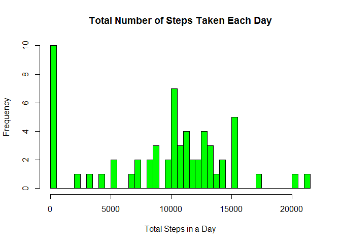
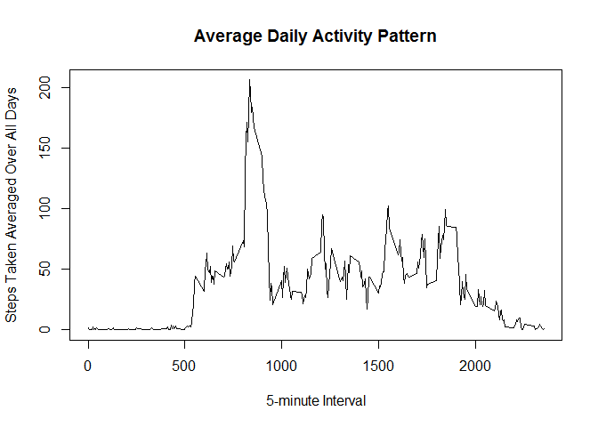
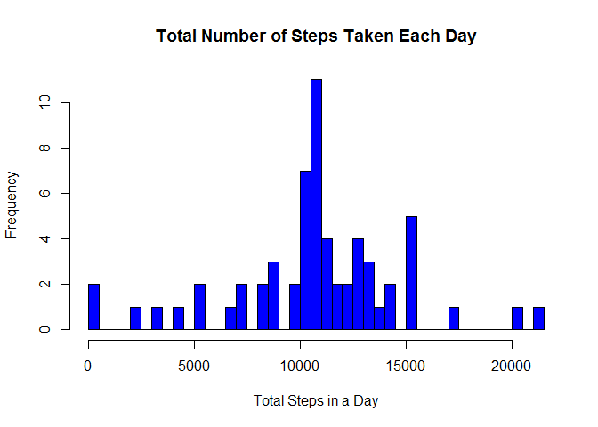
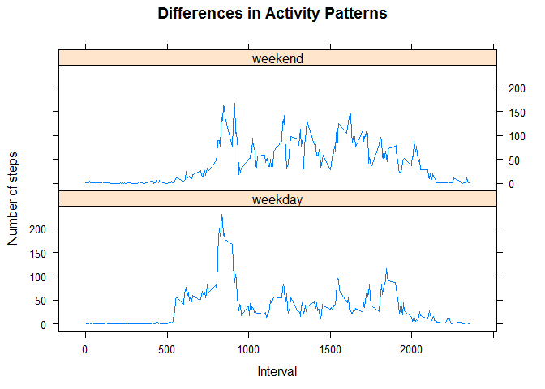

# Reproducible Research: Peer Assessment 1


## Loading and preprocessing the data


```r
# load the data
unzip(zipfile="activity.zip")
AllSteps <- read.csv(file="activity.csv",
                     header=TRUE, 
                     colClasses=c("numeric",
                                  "Date",
                                  "numeric"), 
                     na.strings="NA" )
# convert interval column to a factor
#AllSteps$interval<- as.factor(AllSteps$interval)
```

## What is mean total number of steps taken per day?

```r
DailySteps <- tapply(AllSteps$steps, 
                     AllSteps$date, 
                     FUN = sum, 
                     na.rm = TRUE)
bins <- nrow(DailySteps)
hist(DailySteps, 
     breaks=bins, 
     main="Total Number of Steps Taken Each Day", 
     xlab="Total Steps in a Day",
     col = "green")
```

 


The mean total number of steps taken per day is : 

```r
mean(DailySteps, na.rm = TRUE)
```

```
## [1] 9354
```
The median total number of steps taken per day is : 

```r
median(DailySteps, na.rm = TRUE)
```

```
## [1] 10395
```
## What is the average daily activity pattern?

```r
AverageSteps <- aggregate(steps ~ interval, 
                          data=AllSteps, 
                          FUN=mean, 
                          na.rm = TRUE)
plot(AverageSteps, 
     type="l", 
     main="Average Daily Activity Pattern", 
     xlab="5-minute Interval", 
     ylab="Steps Taken Averaged Over All Days")
lines(AverageSteps)
```

 

The maximum number of steps is taken during this 5-minute interval :

```r
AverageSteps[which.max(AverageSteps$steps),  ]
```

```
##     interval steps
## 104      835 206.2
```

## Inputing missing values
The dataset contains several missing values for the steps variable which may introduce bias into the statistical analysis. The total number of missing values is :

```r
sum(is.na(AllSteps$steps))
```

```
## [1] 2304
```

In an attempt to remove some of the bias caused by missing values, we will replace NA with the average number of steps for that 5-minute interval across all days.

```r
ReplaceNA <- function(steps, interval) {
    filled <- NA
    if (!is.na(steps))
        filled <- c(steps)
    else
        filled <- (AverageSteps[AverageSteps$interval==interval, "steps"])
    return(filled)
}
NewAllSteps <- AllSteps
NewAllSteps$steps <- mapply(ReplaceNA, NewAllSteps$steps, NewAllSteps$interval)
```
Let's look at a histogram of the new data set with missing values replaced:

```r
NewDailySteps <- tapply(NewAllSteps$steps, 
                     NewAllSteps$date, 
                     FUN = sum)
bins <- nrow(NewDailySteps)
hist(NewDailySteps, 
     breaks=bins, 
     main="Total Number of Steps Taken Each Day", 
     xlab="Total Steps in a Day",
     col = "blue")
```

 


We see a higher mean total number of steps taken per day when missing values are replaced: 

```r
mean(NewDailySteps)
```

```
## [1] 10766
```
The median total number of steps taken per day is also higher when missing values are replaced: 

```r
median(NewDailySteps)
```

```
## [1] 10766
```
When missing values were replaced with the average steps for that 5 minute interval, the mean and the median were both higher and actually converged. It is also important to note that when missing values were present for an entire day, that day was considered to have zero steps and this skewed the previous analysis.

## Are there differences in activity patterns between weekdays and weekends?

```r
# Create a new factor variable (daytype) showing whether the date is a weekday or weekend
weekday.or.weekend <- function(date) {
    daytype <- as.factor(weekdays(date))
    if (daytype %in% c("Monday", "Tuesday", "Wednesday", "Thursday", "Friday"))
        return("weekday")
    else if (daytype %in% c("Saturday", "Sunday"))
        return("weekend")
    else
        stop("invalid date")
}
NewAllSteps$date <- as.Date(NewAllSteps$date)
NewAllSteps$daytype <- sapply(NewAllSteps$date, FUN=weekday.or.weekend)
```

Here is a panel plot comparing average number of steps taken
on weekdays and weekends.

```r
library(lattice)
NewAverages <- aggregate(steps ~ interval + daytype, data=NewAllSteps, mean)
xyplot(steps ~ interval|daytype,
       data=NewAverages,
       type="l",
       main="Differences in Activity Patterns",
       xlab="Interval",
       ylab="Number of steps",
       layout=c(1,2))
```

 

Based on these plots, it does appear there is a difference between activity patterns on weekdays and weekends. A spike in number of steps occurs between the 800 and 900 intervals on weekdays, but on weekends the number of steps does not seem to spike but remains fairly constant throughout the day.
